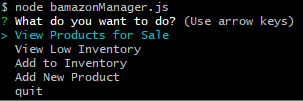
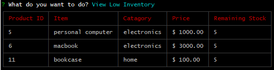

# Bamazon

This app is to demonstrate how to use mysql to manipulate data using node.js. The app itself is similar to amazon where a customer can purchase goods off from a list. If there is not enough stock, the purchases order gets decline, other wise the user be returned the total the spent.

For the manager, they are able to view all products, the items with low stock, add more stock, or add a new product.

## Dependencies

This node app requires the following dependencies to properly run.

- mysql
- cli-table3
- inquirer
- a local mysql server

## Set Up

1. Please clone this repo and run `npm i` to install all the required node dependencies. 
2. Run the `schema.sql` within your chosen mysql user interface (in my case, I used mysql workbench)
..* Run the `seeds.sql` to load your database with some default values to start (not required but recommended)
3. run either `node bamazonCustomer.js` or `node bamazonManager.js` to use the program.

## Customer Side

when bamazonCustomer.js  the user will be prompted with a table where they will be required to place a product id into the input field. The field is validated to ensure that a valid product number is inserted. They will then be prompted to with how much of an item they wish to buy. If the user puts in to little, the order is rejected otherwise it will return the total cost of the order.

## Manager Side

when starting the bamazonManager.js the user will be prompted with 5 choices.

view all products will console log a table with all of the current products within the mysql database.

view low stocks will display any item that has a remaining quantity of 5 or less.

Choosing add more stock will prompt the user to input a product id as how many of that item are added to the remaining stock.

This option will prompt the user to with all of the reqired information to add a new product to the list. a product id will be automatically generated.
